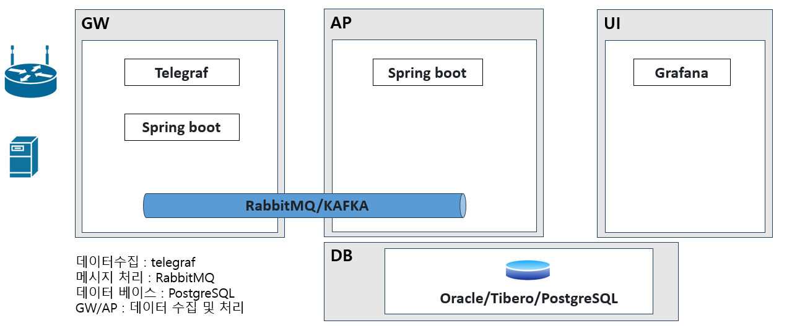
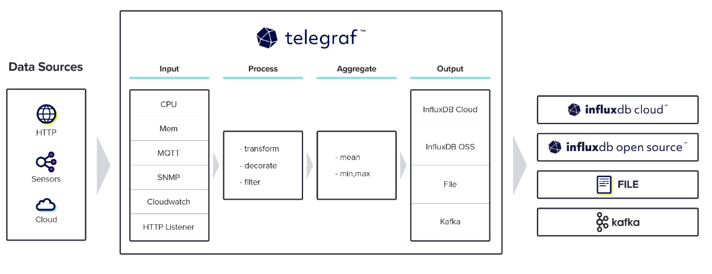
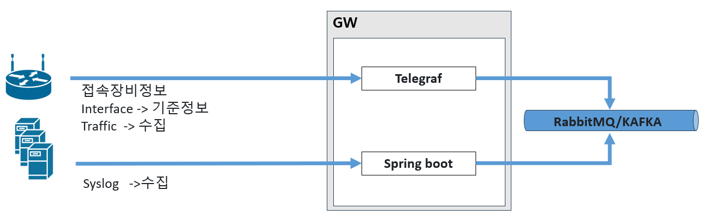
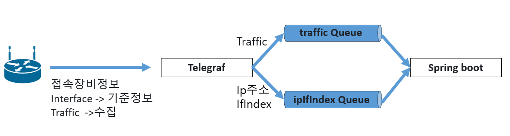
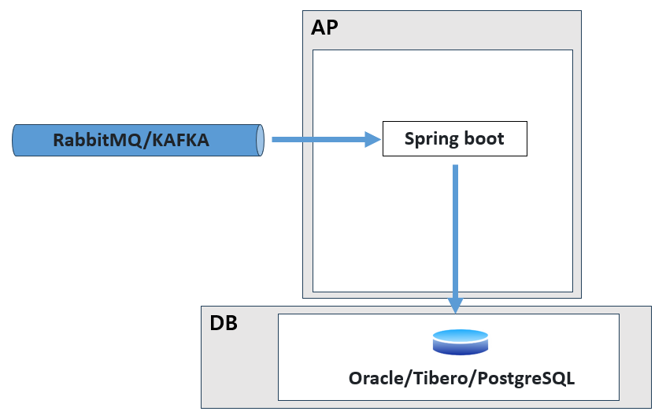
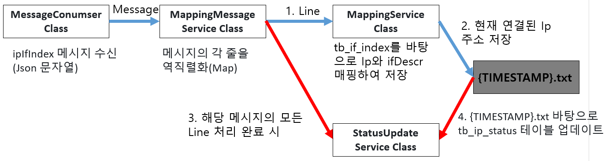
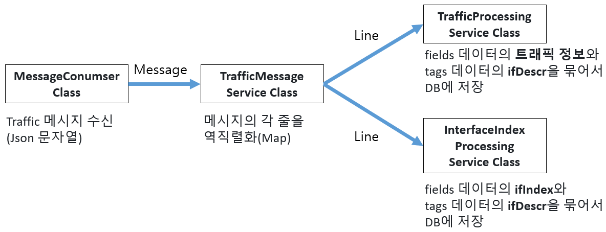
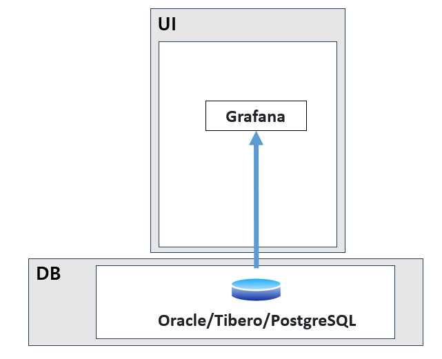
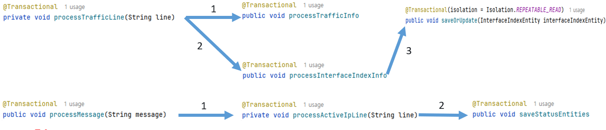
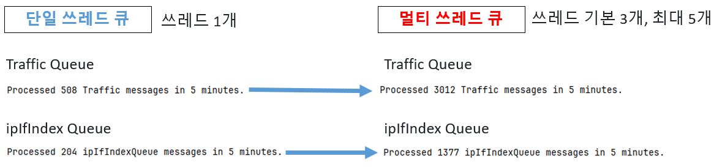

# NetAnalyze_2024 - SNMP 네트워크 모니터링 시스템

**SNMP 프로토콜을 통해 공유기의 무선 액세스 포인트(AP)에서 발생하는 네트워크 트래픽 데이터를 수집하고, 특정 기기의 syslog를 함께 모은 후, 이를 Grafana에서 모니터링하는 시스템**

## 📋 프로젝트 개요

- **Back-End**: 양현성
- **Front-End**: 배훈규
- **개발 기간**: 2024년
- **프로젝트 유형**: 네트워크 모니터링 시스템

## 🛠 기술 스택

### Backend
- **Java 21** (AP 서버) / **Java 17** (GW 서버)
- **Spring Boot 3.3.1** - 메인 프레임워크
- **Spring Data JPA** - 데이터 접근 계층
- **Spring AMQP** - RabbitMQ 메시징
- **Spring WebFlux** - 리액티브 웹 처리
- **PostgreSQL** - 메인 데이터베이스
- **Lombok** - 코드 간소화
- **Gradle** - 빌드 도구 (AP 서버)
- **Maven** - 빌드 도구 (GW 서버)

### Infrastructure & Monitoring
- **Telegraf 1.21.2** - SNMP 데이터 수집 에이전트
- **RabbitMQ** - 메시지 브로커
- **rsyslog** - 시스템 로그 수집
- **Grafana** - 데이터 시각화 및 모니터링
- **InfluxDB 1.7.7** - 시계열 데이터베이스 (Telegraf용)

### Network & Protocols
- **SNMP v2** - 네트워크 장비 모니터링 프로토콜
- **AMQP** - 메시지 큐 프로토콜
- **Syslog** - 시스템 로그 프로토콜

### Operating System
- **CentOS 7** - 서버 운영체제

### Development Tools
- **Git** - 버전 관리
- **Docker** - 컨테이너화 (선택적)

## 🏗 시스템 아키텍처

### 전체 아키텍처


### 주요 기능
1. **Telegraf를 활용한 SNMP 데이터 수집** - 무선 액세스 포인트(AP)에서 트래픽 정보, 인터페이스 정보, 연결된 IP정보 등을 수집
2. **rsyslog를 사용한 syslog 수집** - 시스템 로그 실시간 수집
3. **Spring Boot와 JPA, 멀티쓰레드 큐를 이용한 실시간 데이터 처리** - 수집한 데이터를 실시간으로 DB에 저장
4. **Grafana를 사용한 데이터 시각화** - 저장된 데이터를 대시보드로 모니터링

## 🔧 Why SNMP Protocol?
- SNMP는 특정 OID(Object Identifier)를 통해 장비 내의 자원이나 상태를 식별하고 데이터를 수집할 수 있어, 이를 통해 실시간 네트워크 및 성능 모니터링이 가능

## 📊 What is Telegraf?

- 서버 및 애플리케이션의 메트릭을 수집하고 전송하는 데 사용되는 오픈 소스 에이전트
- 다양한 입력 플러그인을 통해 시스템에서 발생하는 다양한 데이터를 수집
- 출력 플러그인을 통해 수집된 데이터를 데이터 저장소로 전송

=> **본 시스템에서는 SNMP를 입력 플러그인으로 지정하여 공유기에 연결된 각 네트워크 장비의 성능 데이터를 모니터링**

## 🗄 데이터베이스 설계

### DB ERD
[ERD](https://github.com/hyeonseong0917/SNMP_CAPTURE/blob/main/%EB%B3%B4%EA%B3%A0%EC%84%9C/ERD.png)

### 주요 테이블
- `tb_if_traffic_hist` - 인터페이스 트래픽 히스토리
- `tb_if_ip_mapping_mst` - 인터페이스-IP 매핑 마스터
- `tb_ip_status_mst` - IP 상태 마스터
- `tb_syslog_hist` - 시스템 로그 히스토리
- `tb_severity_level_mst` - 심각도 레벨 마스터

## 🔄 데이터 수집 및 처리 플로우

### Telegraf 데이터 수집
- **설정 파일**: [telegraf.conf](https://github.com/hyeonseong0917/SNMP_CAPTURE/blob/main/GW/telegraf/telegraf.conf)
- **수집 주기**: 10초 간격
- **수집 데이터**: 인터페이스 트래픽, 활성 IP 정보



### AP 데이터 수집
- **메시지 컨슈머**: [MessageConsumer.java](https://github.com/hyeonseong0917/SNMP_CAPTURE/blob/main/AP/data_collect/data_collect/src/main/java/com/example/data_collect/configuration/MessageConsumer.java)
- **RabbitMQ 큐 처리**: 동적 쓰레드 풀을 활용한 멀티 쓰레드 큐



### MultiThread Queue
동적 쓰레드 풀을 활용한 멀티 쓰레드 큐 설정: [RabbitMqConfig.java](https://github.com/hyeonseong0917/SNMP_CAPTURE/blob/main/AP/data_collect/data_collect/src/main/java/com/example/data_collect/configuration/RabbitMqConfig.java)

### AP 데이터 처리 및 저장


#### IP-Interface Index Queue 흐름도

- **MappingMessageService Class** - 메시지를 처리(역직렬화)하고 DB에 저장: [MappingMessageService.java](https://github.com/hyeonseong0917/SNMP_CAPTURE/blob/main/AP/data_collect/data_collect/src/main/java/com/example/data_collect/mapping/service/MappingMessageService.java)
- **MappingService Class** - MappingEntity를 DB에 저장하고 {TIMESTAMP}.txt파일에 IP 정보 저장: [MappingService.java](https://github.com/hyeonseong0917/SNMP_CAPTURE/blob/main/AP/data_collect/data_collect/src/main/java/com/example/data_collect/mapping/service/MappingService.java)
- **StatusUpdateService Class** - {TIMESTAMP}.txt파일을 바탕으로 JPA Repository 갱신: [StatusService.java](https://github.com/hyeonseong0917/SNMP_CAPTURE/blob/main/AP/data_collect/data_collect/src/main/java/com/example/data_collect/status/service/StatusService.java)

#### Interface Traffic Queue 흐름도

- **TrafficMessageService Class** - 메시지를 처리(역직렬화)하고 DB에 저장: [TrafficMessageService.java](https://github.com/hyeonseong0917/SNMP_CAPTURE/blob/main/AP/data_collect/data_collect/src/main/java/com/example/data_collect/traffic/service/TrafficMessageService.java)
- **TrafficProcessingService Class** - TrafficEntity를 DB에 저장: [TrafficProcessingService.java](https://github.com/hyeonseong0917/SNMP_CAPTURE/blob/main/AP/data_collect/data_collect/src/main/java/com/example/data_collect/traffic/service/TrafficProcessingService.java)
- **InterfaceIndexProcessingService Class** - 인터페이스 인덱스와 인터페이스 설명을 DB에 저장: [InterfaceIndexProcessingService.java](https://github.com/hyeonseong0917/SNMP_CAPTURE/blob/main/AP/data_collect/data_collect/src/main/java/com/example/data_collect/interfaceIndex/service/InterfaceIndexProcessingService.java)

## 📈 Grafana 대시보드


## 🔒 동시성 제어

### Transactional 격리
동시성 문제를 피하기 위한 Transactional 격리 설정


### 성능 최적화
단일 쓰레드 큐와 멀티 쓰레드 큐의 성능 비교


**멀티쓰레드 큐 사용 시 각 요청을 처리하는 큐에서 기존 대비 약 6배의 처리 속도 개선**

## 🚀 설치 및 설정 가이드

### 1. 모듈 설정
- **OS**: CentOS 7

#### 1.1 RabbitMQ 설정
1. **Exchanges 생성**
   - `traffic-exchange` (Type: Topic)
   - `ipIfIndex-exchange` (Type: Topic)

2. **Queue 생성 및 Binding**
   - `ifTrafficQueue` → `traffic-exchange` (routing key: `traffic-rt-key`)
   - `ipIfIndexQueue` → `ipIfIndex-exchange` (routing key: `ipIfIndex-rt-key`)
   - `log_queue` → `default` (routing key: `default`, durable=true, auto-delete=true)

#### 1.2 Telegraf 설치 및 설정
1. **InfluxDB 설치**
```bash
wget https://dl.influxdata.com/influxdb/releases/influxdb-1.7.7.x86_64.rpm
sudo yum localinstall influxdb-1.7.7.x86_64.rpm
sudo systemctl start influxdb
```

2. **GPG Key 설정**
```bash
sudo cat <<EOF | sudo tee /etc/yum.repos.d/influxdb.repo
[influxdb]
name = InfluxDB Repository - RHEL \$releasever
baseurl = https://repos.influxdata.com/rhel/\$releasever/\$basearch/stable
enabled = 1
gpgcheck = 1
gpgkey = https://repos.influxdata.com/influxdb.key
EOF
```

3. **Telegraf 설치**
```bash
wget https://dl.influxdata.com/telegraf/releases/telegraf-1.21.2-1.x86_64.rpm
sudo yum localinstall telegraf-1.21.2-1.x86_64.rpm
systemctl start telegraf.service
```

4. **Telegraf 설정 파일 수정**
   - [telegraf.conf](https://github.com/hyeonseong0917/SNMP_CAPTURE/blob/main/GW/telegraf/telegraf.conf) 참조
   - RabbitMQ 연결 정보 및 SNMP 설정 필요

#### 1.3 rsyslog 설정
1. **모듈 로드 설정**
```bash
module(load="imuxsock" SysSock.Use="off")
module(load="imjournal" UsePid="system" StateFile="imjournal.state")
```

2. **템플릿 설정**
```bash
template(name="logCaptureFormat" type="string" string="<logCaptureTimeStamp>%timegenerated:1:10:date-rfc3339% %timegenerated:12:19:date-rfc3339%</logCaptureTimeStamp><logCaptureHostName>%HOSTNAME%</logCaptureHostName><logCaptureSyslogTag>%syslogtag%</logCaptureSyslogTag><logCaptureMsg>%msg%</logCaptureMsg><logCaptureSeverity>%syslogseverity-text%</logCaptureSeverity>")
```

3. **로그 전송 설정**
```bash
*.* @"ip주소":8081;logCaptureFormat
```

#### 1.4 Grafana 설정
1. **대시보드 설정**
   - 새로운 대시보드 생성
   - [grafana.json](./UI/Dashboard/grafana.json) 파일 import
   - Variable 설정 (dashboard_name, uid)

2. **Alerting 설정**
   - PostgreSQL Connection 생성
   - Telegram Contact Point 추가
   - [alert.txt](./UI/Alerting/alert.txt) 및 [Description.txt](./UI/Alerting/Description.txt) 참조

### 2. 애플리케이션 설정

#### 2.1 GW 서버 설정
`application.properties` 파일 수정:
```properties
spring.rabbitmq.host=<rabbitmq_ip>
spring.rabbitmq.port=<rabbitmq_port>
spring.rabbitmq.username=<username>
spring.rabbitmq.password=<password>
```

#### 2.2 AP 서버 설정
`application.yaml` 파일 수정:
```yaml
server:
  port: <서버_포트>
spring:
  jpa:
    show-sql: true
    properties:
      format_sql: true
      dialect: org.hibernate.dialect.MySQLDialect
    hibernate:
      ddl-auto: validate
  datasource:
    url: jdbc:postgresql://<DB_IP>:<DB_PORT>/<DB_NAME>
    driver-class-name: org.postgresql.Driver
    username: <DB_USERNAME>
    password: <DB_PASSWORD>
  rabbitmq:
    host: <RabbitMQ_IP>
    port: <RabbitMQ_PORT>
    username: <RabbitMQ_USERNAME>
    password: <RabbitMQ_PASSWORD>
    listener:
      simple:
        concurrency: 5
        max-concurrency: 10
```

## 📁 프로젝트 구조

```
SNMP_CAPTURE/
├── AP/                          # AP 서버 (Spring Boot + Gradle)
│   ├── data_collect/           # 메인 애플리케이션
│   └── data_collect_디렉토리_구조.pdf
├── GW/                         # Gateway 서버 (Spring Boot + Maven)
│   ├── rsyslog/               # rsyslog 설정
│   ├── telegraf/              # Telegraf 설정
│   ├── send log to rabbitmq/  # 로그 전송 서비스
│   └── tool/                  # 유틸리티 도구들
├── UI/                        # 프론트엔드 설정
│   ├── Alerting/              # Grafana 알림 설정
│   └── Dashboard/             # Grafana 대시보드 설정
├── images/                    # 문서용 이미지
└── 보고서/                    # 프로젝트 문서
```

## 📚 주요 문서

- [SNMP capture 통합 보고서](./보고서/100.%20SNMP%20capture%20통합%20보고서.docx)
- [SNMP capture 시스템아키텍처정의서](./보고서/210.%20SNMP%20capture%20시스템아키텍처정의서.docx)
- [ERD 설계서](./보고서/ERD.damx)
- [테이블 정의서](./보고서/테이블%20정의서/)

## 🤝 기여 방법

1. Fork the Project
2. Create your Feature Branch (`git checkout -b feature/AmazingFeature`)
3. Commit your Changes (`git commit -m 'Add some AmazingFeature'`)
4. Push to the Branch (`git push origin feature/AmazingFeature`)
5. Open a Pull Request

## 📄 라이선스

이 프로젝트는 MIT 라이선스 하에 배포됩니다.

## 👥 팀원

- **양현성** - Backend Developer
- **배훈규** - Frontend Developer

---

**NetAnalyze_2024** - 실시간 네트워크 모니터링 솔루션
