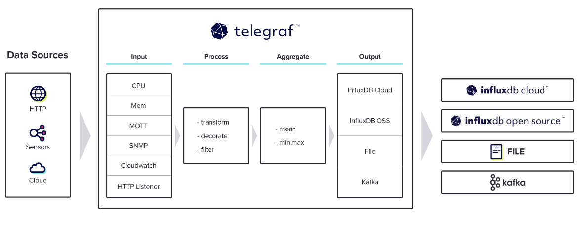

NetAnalyze_2024
=====================
**SNMP 프로토콜을 통해 공유기의 무선 액세스 포인트(AP)에서 발생하는 네트워크 트래픽 데이터를 수집하고, 특정 기기의 syslog를 함께 모은 후, 이를 Grafana에서 모니터링하는 시스템**
<br><br/>
Back-End: 양현성
<br/>
Front-End: 배훈규
<br/>
1. Telegraf를 활용해 무선 액세스 포인트(AP)에서 트래픽 정보, 인터페이스 정보, 연결된 IP정보 등을 수집(B.E)
2. rsyslog를 사용한 syslog 수집(F.E)
3. Spring Boot와 JPA, 멀티쓰레드 큐를 이용해 수집한 데이터를 실시간으로 DB에 저장(B.E)
4. Grafana를 사용하여 저장된 데이터 확인(F.E)
<br><br/>
### Why SNMP Protocol?
- SNMP는 특정 OID(Object Identifier)를 통해 장비 내의 특정 자원이나 상태를 식별하고 데이터 수집이 가능
<br><br/>
### What is Telegraf?

- 서버 및 애플리케이션의 메트릭을 수집하고 전송하는 데 사용되는 오픈 소스 에이전트
- 다양한 입력 플러그인을 통해 시스템에서 발생하는 다양한 데이터를 수집
- 출력 플러그인을 통해 수집된 데이터를 데이터 저장소로 전송
<br><br/>
=> **본 시스템에서는 SNMP를 입력 플러그인으로 지정하여 공유기에 연결된 각 네트워크 장비의 성능 데이터를 모니터링**
<br><br/>
### 전체 아키텍처

<br><br/>
### 데이터 수집
### code
- telegraf 데이터 수집 코드: [telegraf.conf](https://github.com/hyeonseong0917/SNMP_CAPTURE/blob/main/GW/telegraf/telegraf.conf)
<br><br/>

<br><br/>
### AP 데이터 수집
- AP 데이터 수집 코드: [MessageConsumer.java](https://github.com/hyeonseong0917/SNMP_CAPTURE/blob/main/AP/data_collect/data_collect/src/main/java/com/example/data_collect/configuration/MessageConsumer.java)
<br><br/>

<br><br/>
### AP 데이터 처리 및 저장

<br><br/>
### code
- ipIfIndexQueue 흐름도
<br><br/>

- **MappingMessageService Class - 메시지를 처리(역직렬화)하고 DB에 저장**: [MappingMessageService.java](https://github.com/hyeonseong0917/SNMP_CAPTURE/blob/main/AP/data_collect/data_collect/src/main/java/com/example/data_collect/mapping/service/MappingMessageService.java)
- **MappingService Class - MappingEntity를 DB에 저장하고 {TIMESTAMP}.txt파일에 IP 정보 저장**: [MappingService.java](https://github.com/hyeonseong0917/SNMP_CAPTURE/blob/main/AP/data_collect/data_collect/src/main/java/com/example/data_collect/mapping/service/MappingService.java)
- **StatusUpdateService Class - {TIMESTAMP}.txt파일을 바탕으로 JPA Repository 갱신**: [StatusService.java](https://github.com/hyeonseong0917/SNMP_CAPTURE/blob/main/AP/data_collect/data_collect/src/main/java/com/example/data_collect/status/service/StatusService.java)
<br><br/>
- ifTrafficQueue 흐름도
<br><br/>

- **TrafficMessageService Class - 메시지를 처리(역직렬화)하고 DB에 저장**: [TrafficMessageService.java](https://github.com/hyeonseong0917/SNMP_CAPTURE/blob/main/AP/data_collect/data_collect/src/main/java/com/example/data_collect/traffic/service/TrafficMessageService.java)
- **TrafficProcessingService Class - TrafficEntity를 DB에 저장**: [TrafficProcessingService.java](https://github.com/hyeonseong0917/SNMP_CAPTURE/blob/main/AP/data_collect/data_collect/src/main/java/com/example/data_collect/traffic/service/TrafficProcessingService.java)
- **InterfaceIndexProcessingService Class - 인터페이스 인덱스와 인터페이스 설명을 DB에 저장**: [InterfaceIndexProcessingService.java](https://github.com/hyeonseong0917/SNMP_CAPTURE/blob/main/AP/data_collect/data_collect/src/main/java/com/example/data_collect/interfaceIndex/service/InterfaceIndexProcessingService.java)
<br><br/>

<br><br/>
### Grafana(F.E)

<br><br/>
### Transactional 격리

<br><br/>

# 1. module 설정
- OS: CentOS 7
## 1.1 RabbitMQ
1. Exchanges 생성
   - traffic-exchange
      - Type: Topic
   - ipIfIndex-exchange
       - Type: Topic
<br/>

2. Queue 생성 및 Exchanges와 Routing key를 각각 bind
   - ifTrafficQueue
      - exchange: traffic-exchange
      - Routing key: traffic-rt-key
   - ipIfIndexQueue
     - exchange: ipIfIndex-exchange
     - Routing key: ipIfIndex-rt-key
   - log_queue
     - exchange: defualt
     - Routing key: default
     - config : durable=true, auto-delete=true
<br/>

## 1.2 telegraf
1. InfluxDB 설치
``` 
wget https://dl.influxdata.com/influxdb/releases/influxdb-1.7.7.x86_64.rpm
sudo yum localinstall influxdb-1.7.7.x86_64.rpm
sudo systemctl start influxdb
```
<br/>

2. gpgkey 설정
``` 
sudo cat <<EOF | sudo tee /etc/yum.repos.d/influxdb.repo
[influxdb]
name = InfluxDB Repository - RHEL \$releasever
baseurl = https://repos.influxdata.com/rhel/\$releasever/\$basearch/stable
enabled = 1
gpgcheck = 1
gpgkey = https://repos.influxdata.com/influxdb.key
EOF
```
<br/>

3. Telegraf 설치
``` 
wget https://dl.influxdata.com/telegraf/releases/telegraf-1.21.2-1.x86_64.rpm
sudo yum localinstall telegraf-1.21.2-1.x86_64.rpm
systemctl start telegraf.service
```
<br/>

4. /etc/telegraf/telegraf.conf 파일 수정
     https://github.com/hyeonseong0917/SNMP_CAPTURE/blob/main/GW/telegraf/telegraf.conf
       
telegraf.conf: output plugin와 inputs plugin 수정 필요
```
[[outputs.amqp]]
    ## RabbitMQ 서버 연결 정보 설정: <>는 제거하고 값만 입력
    url = "amqp://<rabbitmq_id>:<rabbitmq_pw>@<rabbitmq_ip>/"

    ## 메시지 전송에 사용할 exchange 설정
    exchange = "traffic-exchange"

    ## 메시지 전송 시 사용할 routing key 설정
    routing_key = "traffic-rt-key"
    data_format = "json"
    namepass = ["interface"] ## inputs.snmp의 각 tagpass와 일치
```
```
[[inputs.snmp]]
    ## SNMP를 통한 데이터 수집 설정: <>는 제거하고 값만 입력
    interval = "10s"
    agents = ["<공유기의 Ip 주소>:<공유기 Port 값>"]
    version = 2
    community = "커뮤니티 문자열"
```
<br/>

## 1.3 rsyslog
1. 주석 해제 (없을 시 생성)
```
module(load="imuxsock"    # provides support for local system logging (e.g. via logger command)
       SysSock.Use="off") # Turn off message reception via local log socket;
                          # local messages are retrieved through imjournal now.
module(load="imjournal"             # provides access to the systemd journal
       UsePid="system" # PID nummber is retrieved as the ID of the process the journal entry originates from
       StateFile="imjournal.state") # File to store the position in the journal
```
<br/>

2. 타임스탬프의 형태 지정
```
module(load="builtin:omfile" Template="RSYSLOG_TraditionalFileFormat")
```
<br/>

3. 전송할 로그의 형태를 다음과 같이 지정 (두 방법 중 하나를 선택)
```
template(name="logCaptureFormat" type="string" string="<logCaptureTimeStamp>%timegenerated:1:10:date-rfc3339% %timegenerated:12:19:date-rfc3339%</logCaptureTimeStamp><logCaptureHostName>%HOSTNAME%</logCaptureHostName><logCaptureSyslogTag>%syslogtag%</logCaptureSyslogTag><logCaptureMsg>%msg%</logCaptureMsg><logCaptureSeverity>%syslogseverity-text%</logCaptureSeverity>")
```
```
$template logCaptureFormat,"<logCaptureTimeStamp>%timegenerated:1:10:date-rfc3339% %timegenerated:12:19:date-rfc3339%</logCaptureTimeStamp><logCaptureHostName>%HOSTNAME%</logCaptureHostName><logCaptureSyslogTag>%syslogtag%</logCaptureSyslogTag><logCaptureMsg>%msg%</logCaptureMsg><logCaptureSeverity>%syslogseverity-text%</logCaptureSeverity>"
```
<br/>

4. 수집할 로그의 타입과 경로 지정 (수집하고 싶은 로그의 타입을 추가할 수 있다)
```
*.info;  /var/log/messages    => info 이상의 로그를 messages에 저장
mail.*   /var/log/maillog     => 메일에 관련된 모든 로그르 maillog에 저장
*.emerg :omusrmsg:*           => 모든 사용자가 긴급 메시지를 받을 수 있도록 설정합니다
```
<br/>

5. 수집할 ip 주소 및 포트 입력
```
*.* @"ip주소":8081;logCaptureFormat
ex) *.* @192.168.0.5:8081;logCaptureFormat
```
<br/>

6. rsyslog 재시작
```
systemctl restart rsyslog
```
<br/>

## 1.4 Grafana
### 1.4.1 대시보드 설정
1. 새로운 대시보드 생성
2. import a dashboard 선택
3. grafana.json 파일 선택
4. variable에서 dashboard_name과 uid 수정 (dashboard_name : 자신이 설정한 대시보드 이름, uid : 대시보드의 uid) <br/>
   >ex) ~/d/ddu231vg7a8e8e/complete-4?orgId=1&refresh=auto <br/>
   >dashboard_name = complete 4, uid = ddu231vg7a8e8e
<br/>

### 1.4.2 Alerting 설정
1. Connections에서 새로운 connection을 postgreSQL로 생성
2. URL, database의 이름, username, password 설정
3. Alerting에서 Contact points를 통해서 telegram 추가 (telegram chatbot의 api token 필요)
4. UI/alert에서 alert.txt의 코드와 Description.txt의 코드를 사용하여 alert 설정을 구성 (상세 설정 방법은 /UI/Alerting/alert 설정 적용.pptx에 기재)
<br/>

# 2. 사용자 메뉴얼
## 2.1 환경 구축
1. ERD 설계서에 알맞게 테이블 설정
2. RabbitMQ의 설정에 맞추어 큐 생성
3. telegraf.conf 수정 및 재시작
4. 로그를 전송할 device의 rsyslog.conf 수정 및 재시작
<br/>

## 2.2 GW 및 AP 코드 수정
### 2.2.1 GW
application.properties 파일 수정
```
spring.rabbitmq.host = rabbitmq가 실행 중인 서버의 IP

spring.rabbitmq.port = rabbitmq가 실행 중인 서버의 port

spring.rabbitmq.username = 설정한 username

spring.rabbitmq.password = 설정한 password
```
<br/>

### 2.2.2 AP
1. application.yaml 파일 수정: <>는 제거하고 값만 입력
```
server:
  port: <서버를 실행하고자 하는 포트>
spring:
  jpa:
    show-sql: true
    properties:
      format_sql: true
      dialect: org.hibernate.dialect.MySQLDialect
    hibernate:
      ddl-auto: validate
  datasource:
    url: jdbc:postgresql://<DB의 Ip주소>:<DB의 Port주소>/<DB이름>
    driver-class-name: org.postgresql.Driver
    username: <DB의 id>
    password: <DB의 password>
  rabbitmq:
    host: <RabbitMQ의 Ip주소>
    port: <RabbitMQ의 Port주소>
    username: <RabbitMQ의 id>
    password: <RabbitMQ의 password>
    listener:
      simple:
        concurrency: 5 # 동시에 실행되는 쓰레드 개수
        max-concurrency: 10 # 최대 쓰레드 개수

```
<br/>

## 2.3 Grafana 설정
1.4.1과 1.4.2의 방식으로 대시보드와 알림 기능 설정
